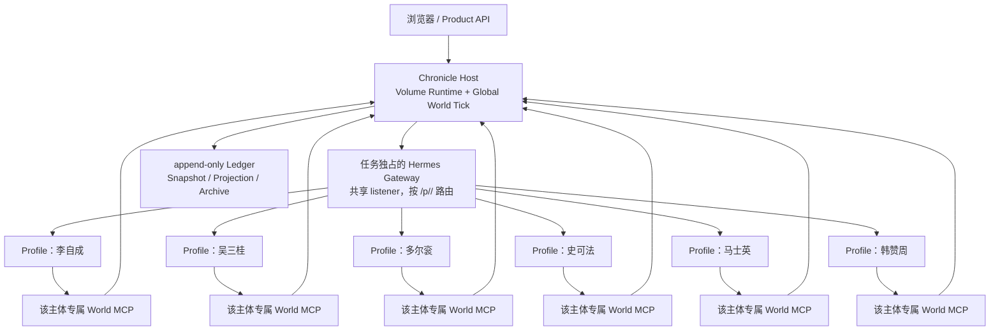

# Hermes 多主体 Profile 运行说明

> 读者：开发者、产品架构人员和验收人员。本文解释当前实现，不是普通用户的上手指南；普通用户只需从 [README](../README.md) 开始。

这份说明回答一个核心问题：为什么 Chronicle 不让一个全知 Agent 替所有人做决定，而是把同一卷历史中的每个持久主体分别运行成 Hermes Profile？答案不是“多放几个角色”，而是把身份、上下文、权限、协作和回看都做成可以核对的边界。

## 先给结论

当前《甲申》Volume 有六个长期主体：李自成、吴三桂、多尔衮、史可法、马士英和韩赞周。每个主体都拥有：

- 一个与 `worldline_id + lifetime_id` 绑定的 Hermes Profile 身份；
- 自己的 Hermes Home、配置、SOUL、Memory 文件、API key 和 World MCP binding；
- 跨离席、重启和多次唤醒仍能识别的 Lifetime 状态；
- 每次唤醒新建的 Hermes Session；
- 只包含当时可见事实的冻结 Perspective。

这些 Profile 不是六个互相共享私有提示词的“聊天窗口”，也不是一个叫 Coordinator 的中央 Agent。Chronicle 用现有 Hermes Profile 负责主体的解释和提案，用现有 Volume Host 负责共同世界的时间、权限、因果、原子提交和清理。

## 当前拓扑

当前使用的是 Hermes 的 multiplexed Gateway：一个任务独占的 loopback Gateway 承载多个逻辑 Profile，再通过 Profile 路径把请求送到目标 Profile。逻辑上的独立身份不等于每个 Profile 都要有独立进程或端口；也不应把 Profile Home 隔离误解成操作系统沙箱。

## 为什么用 Hermes Profile，而不是自建“角色层”

Hermes 在这里承担的是执行基础设施，Chronicle 承担的是历史世界和业务规则。这样分工的优势是：主体可以拥有真正的运行边界，而 Chronicle 不需要再造一套 Agent Runtime、Session、Memory、Gateway 或 Profile Registry。

| Hermes 原生能力 | Chronicle 的使用方式 | Chronicle 额外负责的部分 |
| --- | --- | --- |
| Profile Home、配置和 SOUL | 为每个 Lifetime 安装/校验真实 Profile，保存主体章程和执行配置 | 把 Profile 与 Volume/Lifetime 的归属 marker 绑定，并在漂移时拒绝恢复 |
| Session 与 Memory | 每次 Wake 使用 fresh Session；普通 Wake 禁止持久 Memory mutation | 把 Session 记录关联到 Wake，把主体的 Course、Knowledge 和判断历史留在 Volume 状态中 |
| Gateway 与 Profile 路由 | 通过同一个任务 Gateway 的 `/p/<profile>/...` 路由寻址目标 Profile | 只启动和清理当前 Volume 所拥有的 Gateway，不接管未知进程 |
| Toolset 与 MCP | 每个 Profile 只启用自己的 World MCP 和必要的 Memory toolset | 在 MCP 入口核验 binding、Wake、权限、schema 和幂等键 |
| Hermes Agent loop | 让 Profile 解释冻结视角、处理不确定性并提出结构化意图 | Host 负责时间、因果、资源、原子提交、消息抵达和世界效果 |

这不是把 Chronicle 业务逻辑藏进 SOUL，也不是把 Hermes 当成数据库。Hermes 保证“哪个主体在执行、用哪个 Session 和哪些工具”；Volume Runtime 保证“什么事实对它可见、它的提案能否发生、发生后如何留下可回看的因果”。

## 一个 Profile 实际拥有的东西

Profile 不是一段角色提示词。Chronicle 在创建 live Volume 时，会为每个 Lifetime 安装或校验真实 Profile，并写入归属 marker：Volume、Lifetime、内容版本、genesis hash、runtime epoch、Profile 名称和 ownership marker 必须全部匹配。无法证明归属时，启动和恢复会 fail closed，而不是按同名目录继续运行。

Profile 的关键边界如下：

| 边界 | 当前实现 | 价值 |
| --- | --- | --- |
| 身份 | Profile 名称由 `worldline_id + lifetime_id` 派生，marker 固定归属 | 离席、重启或回到书案时仍是同一个主体 |
| 认知上下文 | 每个 Profile 有自己的 Home、SOUL、Memory 和配置 | 不把一个人的私有上下文复制给另一个人 |
| Session | 每次 Wake 建立 fresh Session；Profile 身份不变 | 避免把上一轮对话误当成当前可见事实，同时保留主体连续性 |
| 工具与凭据 | 每个 Profile 有独立 API key、World token 和 Profile-specific MCP | 一个主体不能用另一个主体的 binding 读取或写入世界 |
| 可见范围 | Wake 只收到自己的 frozen Perspective | 后来发生的事、其他主体的私有判断和未送达消息不会提前进入上下文 |
| 最终决定 | Profile 只提交结构化提案；Host 才能提交世界效果 | 模型可以解释和选择，但不能自行宣布资源、时间或结果 |

## 一次 Wake 如何走完

同一轮世界推进中，主体之间先分别判断，再由 Host 统一提交。顺序是：

1. Host 推进唯一的 Global World Tick，并冻结本轮 Pending Logical Moment。
2. Host 为每个待处理主体编译当时合法的 Perspective，包含可见事实、当前 Course、权限和主体已知的不确定性。
3. 目标 Profile 建立一个以 Wake 标识的 fresh Session；普通 Wake 不调用 Memory。
4. Profile 通过自己的 World MCP 提交一次 `commit_deliberation` 或一个受限 `logical_intent`。这一步只是在当前 moment 中 staging，不直接改变公共世界。
5. MCP 先核对 token、Worldline、主体角色、Wake 身份、权限、schema 和幂等键；不匹配就拒绝。
6. Host 收齐本轮已冻结 Wake 的提案，按稳定顺序校验并在同一个 atomic commit 中写入 Intent、判断、计划、消息、操作、因果 parents 和 `MOMENT_COMMITTED`。
7. 消息、调查结果、Operation、Revisit 和外部 Field Event 按世界时间进入未来 tick；主体下一次 Wake 才能看到已经抵达的事实。

因此，Profile 的输出永远是“我依据当前所见提出什么”，而不是“世界已经发生了什么”。被拒绝的提案会留下可审计结果；同一个幂等键重试只返回既有结果，不产生第二个世界效果。

## 多主体为什么有用

### 1. 每段人生都有自己的连续性

如果只有一个全知 Agent，离席后的行动、不同人物的限制和重新进入时的上下文很容易被压成一条总叙事。独立 Profile 让“同一个人继续活着”成为可验证的状态：Profile 身份保持稳定，Lifetime 的 Course、Knowledge、Belief、资源和已落笔判断由 Volume 持久化，Session 只是本次执行的短期载体。

### 2. 观点可以真正不同，而不是换一段提示词

六个主体读取的是各自的 Perspective、已知事实、资源和 authority。李自成、吴三桂、多尔衮不会因为共享同一个模型就共享私有判断；南京的史可法、马士英和韩赞周也各自面对自己的位置和程序约束。这样“独立判断”有身份、输入和权限三层证据，而不只是页面上的不同称呼。

### 3. 协作通过世界发生，而不是通过私聊作弊

Profile 之间没有隐形的共享 Memory 或直接注入对方上下文。它们只能通过真实的 World MCP 工具和世界中的消息、Offer、Agreement、Investigation、Operation 等路径影响彼此；消息要经过 route 和 simulated travel time，只有抵达后才进入收件人的 Knowledge，并可能触发新的 Attention/Wake。

这让“多主体协作”具备因果顺序：可以回答谁先知道、谁发出、何时抵达、对方依据哪条事实重新判断，而不是只看到一个最终摘要。

### 4. Agent 的灵活性和世界的确定性各司其职

Hermes Profile 处理解释、不确定性、计划和提案；Host 处理认证、权限、时间、路线、资源、幂等、原子事务和硬性边界。任何模型输出都必须穿过 Host 的 mutation boundary 才能成为 Ledger 事件。

这保留了语言模型适合处理的开放判断，同时避免让模型直接改写历史、越过权限或把未发生的结果写成事实。

### 5. 离席、重启、回看和封存可以连成一条证据链

同一个 Volume 可以把 Profile identity、fresh Session、Wake/Deliberation、Ledger causal parents、Archive judgment history 和 Seal/REVOKED 连接起来。用户离开一段人生后，其他主体仍然可以继续；用户回来时，看到的是已经向前走过的公共世界，而不是被暂停的页面。

封存时，Host 原子地写入 `VOLUME_SEALED`，撤销该卷册的 bindings，取消待处理 Wake，然后只清理 marker 明确属于该 Volume 的 Profile、MCP entry 和 Gateway 状态。历史保留，运行资源回收。

## “多主体”不等于什么

- 不等于一个通用多 Agent 平台；Chronicle 没有抽取公共 Runtime、Registry、Router 或新的 Session/Memory 系统。
- 不等于一个 Hermes Coordinator；当前没有中央模型替所有主体路由、批准或综合决定。Host 的确定性协调和 Profile 的主体判断是两种不同职责。
- 不等于自由的 Agent-to-Agent 私聊；必须有真实可调用的 MCP/世界传输，且消息的可见性和抵达时间由 Host 决定。
- 不等于 Profile 之间可以互读文件、Memory、token 或私有 prompt。每个 Profile 的 binding、toolset 和 context 都按主体隔离，跨身份调用应被拒绝。
- 不等于独立进程、独立端口或完整 OS 沙箱。当前实现使用一个任务独占的 multiplexed Gateway；需要进程级故障域时，必须另行设计并验证，不能从 Profile 名称推断出来。
- 不等于模型稳定性保证。一次真实 Provider 轨迹证明一条业务链可运行，不证明不同 Provider、版本、提示或重复运行都得到同样选择。

## 源码与证据索引

### 运行时边界

- [`chronicle/hermes.py`](../chronicle/hermes.py)：Profile materialization、归属 marker、Profile env/config、fresh Session、Profile 路由、Gateway multiplex 配置和 cleanup。
- [`chronicle/volume_live.py`](../chronicle/volume_live.py)：读取 frozen Perspective、调用 Hermes、检查普通 Wake 的 Memory 不变、要求结构化提案并 fail closed。
- [`chronicle/world_mcp.py`](../chronicle/world_mcp.py)：按 binding 和 Wake 身份授权，提供 Profile-specific World MCP、`logical_intent` 和 `commit_deliberation` staging。
- [`chronicle/volume_runtime.py`](../chronicle/volume_runtime.py)：Host 的 staging、权限和 schema 校验、atomic moment commit、causal Ledger、boundary、Seal 和 cleanup。
- [`hermes/chronicle-actor/config.yaml`](../hermes/chronicle-actor/config.yaml)：当前 actor distribution 的 multiplexed Gateway、Profile toolset 和 Memory 配置。
- [`hermes/chronicle-actor/SOUL.md`](../hermes/chronicle-actor/SOUL.md)：主体只能依据自己的 Perspective 行动，不能使用后世知识、终端或其他主体上下文的协议边界。

### 直接回归

- [`tests/test_v5_hermes.py`](../tests/test_v5_hermes.py)：所有 Lifetime Profile 的 materialization、marker、重复加载和 cleanup。
- [`tests/test_v5_live_bridge.py`](../tests/test_v5_live_bridge.py)：每个主体独立 token、启动 reconcile、binding drift fail closed、fresh Session、结构化提案和“一次 Wake 一次写入”。
- [`tests/test_v6_deliberation.py`](../tests/test_v6_deliberation.py)：HOLD/REVISE、单次 Deliberation、拒绝后幂等、重启 replay 和 atomic commit。
- [`tests/test_v6_proof_layers.py`](../tests/test_v6_proof_layers.py)：Course 在 restart、controller switch 和 fresh context 下保持连续。
- [`tests/test_live_runtime.py`](../tests/test_live_runtime.py)：live Profile/Gateway 生命周期、binding revoke、精确 cleanup 和未知资源 fail closed。

### 真实业务证据

当前脱敏验收记录见 [`docs/ACCEPTANCE.md`](ACCEPTANCE.md)。最近一次隔离 real Hermes Volume 将六个真实主体、fresh Session、Human Course/Leave/re-entry、吴三桂的 `BACKGROUND → REOPEN → HOLD`、多尔衮和南京主体的独立判断、消息/Agreement/Operation、Archive、Seal、`REVOKED` bindings 与精确 cleanup 关联在同一个 Volume 中。

该记录仍然只是一条受控 Provider 轨迹：它证明当前 Profile、transport、Host mutation boundary 和生命周期链可以一起运行，不宣称 Provider 稳定性 benchmark，也不代替真人产品反馈。

## 当前判断边界

如果要修改 Profile、工具权限、消息传输或 Profile 暴露方式，先回到本说明的四个问题：

1. 这个主体是否真的需要独立长期身份、上下文、权限或生命周期？
2. 它如何通过真实传输和其他主体协作，而不是只在文档中“看起来能协作”？
3. 哪些结果仍只是 Profile 提案，哪一步由 Host 确定性校验并提交？
4. 能否在同一业务对象上关联 Profile identity、Session、causal Ledger、Archive/Seal 和精确 cleanup？

若这四个问题答不清，不应再增加 Profile 或新的协调层；应先修正现有边界和证据。
