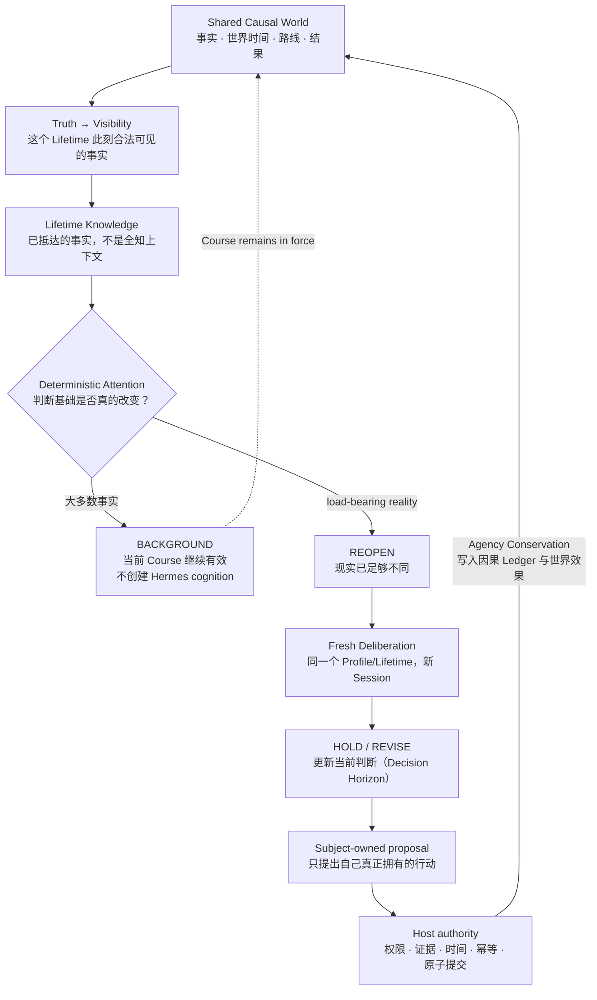
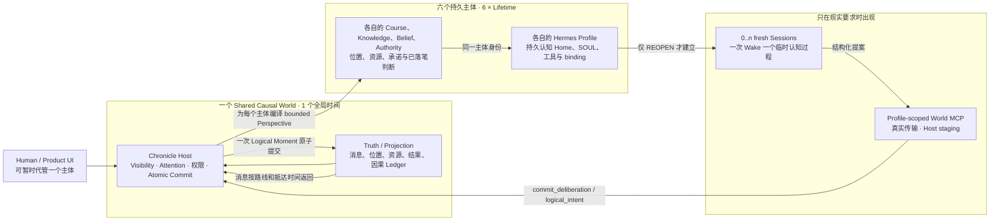

# 多主体不是六个聊天窗口

> Hermes Profile 如何让 Chronicle 里的主体沿着已经作出的判断继续生活

本文面向开发者、产品架构人员和验收人员。它解释当前实现的核心模型，不是普通用户的启动指南；普通用户请从 [README](../README.md) 开始。

## 先记住一句话

Chronicle 的多主体能力，不是让一个模型同时扮演六个人，也不是让六个聊天窗口轮流生成下一段剧情。

它要证明的是：

> **判断具有持续时间。**

一个人已经作出的判断，会在世界时间里继续有效。世界可以继续推进，新的事实可以进入这个人的知识，但大多数变化不值得重新调用认知。只有当现实真正改变了此前判断的基础，主体才重新思考一次，并让新的判断继续生效。

```text
形成判断
  → 判断在世界时间中继续有效
  → 世界继续，事实继续抵达
  → 事实进入这个人的 Knowledge
  → 大多数变化只停留在 BACKGROUND
  → 判断基础真的改变
  → REOPEN，进行一次 fresh Deliberation
  → HOLD 或 REVISE
  → 新判断继续有效
```

这就是六个 Hermes Profile 的共同价值：它们不是六个名字，而是六段不会因为新 Session、离席或重启而被重置的人生连续性。

## 核心因果拓扑

这张图是本文的主图。它不从组件目录开始，而从因果关系开始：一个事件先成为世界事实，再经过可见性进入某个主体的知识；知识不自动等于重新思考；主体的提案还必须经过 Host 的权威边界，才能成为共享世界的新事实。



图中的几个词有严格含义：

- `Course` 是一个 Lifetime 当前仍然有效的判断，不是目标、任务、工作流或 Todo 列表。
- `Attention` 是 Host 内的确定性纯逻辑，不由模型决定是否唤醒自己；它把事件分成 `BACKGROUND` 和 `REOPEN`。
- `Deliberation` 只在 `REOPEN` 后发生。新的 Session 不是新的人生，而是同一个 Lifetime 在新的现实面前重新形成判断。
- `Agency Conservation` 是世界不变量：主体只能提交自己拥有的权限、资源、位置和承诺；模型不能凭一句话让另一个主体同意，也不能把提案直接写成结果。

## 一卷世界里到底有哪些“人”

当前《甲申》卷册承载六个独立主体：李自成、吴三桂、多尔衮、史可法、马士英和韩赞周。每个主体都有一条持久的 `Lifetime`，并由一个 Hermes Profile 作为其认知执行家。它们共享一个世界，但不共享私有判断。



这张图表达四个边界：

1. **世界只有一个权威。** 全局时间、事实、路线、消息抵达、资源变化、因果记录和封存边界属于 Volume Host，不属于任何模型。
2. **主体有六个连续身份。** `Lifetime` 持有跨离席、重启、控制者切换和多次唤醒仍然有效的状态；不同主体的过去、知识、权限、位置和 Course 不同。
3. **Profile 是 Hermes 的执行家，不是业务数据库。** Profile Home、SOUL、配置、凭据和 MCP binding 让 Hermes 知道“谁在执行”；Chronicle 的 Course、Knowledge、Belief 和判断历史仍由 Volume 持久化。
4. **Session 是临时的。** 一个真实 Wake 使用一个 fresh Session；没有新的 `REOPEN`，就没有为了“保持热度”而强行生成的新认知。

逻辑上的六个 Profile 不等于六个进程、六个端口或六个操作系统故障域。当前实现使用任务独占的 multiplexed Hermes Gateway，用 Profile 路径寻址多个逻辑 Profile；需要进程级隔离时必须另外设计和验证，不能从 Profile 名称推断出来。

## Hermes 与 Chronicle 各自负责什么

这里采用的是“主体更厚、Host 更薄”的分工：Profile 可以在自己的证据范围内解释、不确定、等待和选择；Host 只做必须确定的现实约束。Chronicle 没有再造一套 Agent Runtime、Session、Memory、Gateway、Registry 或 Coordinator Profile。

| Hermes Profile 提供 | Chronicle Host 保证 |
| --- | --- |
| 持久的 Profile identity、Home、SOUL、配置和工具面 | `worldline_id + lifetime_id` 的真实归属，marker 漂移时 fail closed |
| 对 bounded Perspective 的解释、主体不确定性和结构化提案 | Truth、Visibility、Knowledge admission 和唯一世界时间 |
| 一个主体的选择、HOLD/REVISE 判断和自己拥有的下一步 | authority、资源、路线、消息抵达、前置条件和 Agency Conservation |
| 每次 Wake 的 fresh Session | Wake、controller、幂等键、schema 和 frozen Logical Moment 校验 |
| 通过 World MCP 表达“我想做什么” | staging 与 atomic commit；模型输出在此之前都只是 proposal |

两边不能互相越权：

- Hermes 不能把尚未抵达的消息当成已知事实，不能读取别人的私有上下文，也不能直接写公共世界。
- Host 不能替主体编造信念、心理或“正确答案”，也不能把 `BACKGROUND` 事件偷偷升级为认知。
- `Memory` 不是业务真相。普通 Wake 不应把 Hermes Memory 当作持续人生的唯一来源；当前连续性来自 Lifetime 的持久状态和可追溯 Ledger。

## 一次真实的判断是怎样发生的

以吴三桂为例，Human 可以先留下这样的当前判断：

```text
暂时不作最终归属；
继续保持关口可控；
等待清方明确回复；
如果东向现实真的发生变化，再重新判断。
```

这不是一条自动执行的任务，而是一个 `Course`。之后同一卷世界按以下顺序向前：

1. **Human Leave。** 这只改变当前控制者；吴三桂的 Lifetime、Course 和 Profile identity 不会被重置。
2. **世界继续。** 其他主体可以在自己的现实中行动，消息会经过真实的 World MCP、路线和未来抵达时间。
3. **事实先进入 Knowledge。** 吴三桂可能收到许多不重要的事实；它们仍被记录，但由确定性 Attention 判为 `BACKGROUND`，不调用 Hermes。
4. **其他主体独立判断。** 多尔衮依据自己的 Perspective 重新判断；李自成也依据自己的现实在另一个时间点判断。没有一个中央 Agent 替他们综合出唯一答案。
5. **负载事实抵达。** 当真正改变吴三桂 Course 基础的事实进入他的 Knowledge，Attention 才返回 `REOPEN`。
6. **Fresh Wu Deliberation。** Hermes 用同一个 Profile/Lifetime 建立新 Session，看到此前的 Course、自上次判断以来发生的事实、仍未解决的依赖和未知信息。
7. **HOLD 或 REVISE。** 新 Session 不能凭“我是新 Session”发明一段新人生；它只能在当前事实和权限内提交一次结构化判断及可选的主体行动。Host 校验后，才在一个原子 Logical Moment 中留下新 Course、因果关系和世界效果。

Human 再次进入吴三桂时，产品应能解释的是：

> 此前一直这样办；直到这里，现实变了；这段人生因此坚持或改了方向。

而不是“AI 自动替你执行了七个回合”。这也是南都定策等后续局势复用的认知时间模型：不是为山海关写一套特殊脚本，而是同一条 `Knowledge → Attention → Deliberation → Course` 语义。

## 协作为什么是真实的

多主体协作不是 Profile 之间交换私有提示词。一个主体影响另一个主体，必须在共享世界里留下可观察的因果路径：

```text
主体拥有的行动
  → 消息 / Offer / Agreement / Investigation / Operation
  → Host 验证来源、权限、路线和抵达时间
  → 事实进入接收方的 Visibility / Knowledge
  → 接收方的 Attention 判断 BACKGROUND 或 REOPEN
  → 接收方独立 Deliberation
```

因此可以回答：谁发出、谁在当时有权发出、什么时候抵达、对方什么时候知道、哪条事实使对方重判。没有 free A2A、没有隐形共享 Memory，也没有“同意”自动成立：Agreement 必须由拥有相应 Agency 的主体和确定性世界过程共同产生。

## 用户真正获得的体验

多主体的价值不在于同时看到更多 Agent 输出，而在于以下四件事可以同时成立：

- **不同的人真的不同。** 差异来自不同的过去、已知事实、位置、资源、权威、承诺和当前判断，而不是换一段人格提示词。
- **离席不会暂停世界。** 你暂时不代管一个主体时，其他主体和公共世界仍继续；你回来时，看到的是已经抵达的现实。
- **等待是有意义的。** 大多数变化不会强迫主体每天重算；一个判断可以真正“等到某件事发生”。
- **回看能还原因果。** 可以区分当时知道什么、后来什么才抵达、哪一次重判改变了方向，以及后果如何回到共同世界。

最终感受应该是：

> **这些人并不是每一天都重新被 AI 算一次；他们沿着已经作出的判断继续生活，只有现实变得足够不同时才重新想。**

## 明确不是什么

- 不是一个通用的多 Agent 平台，也不是为了“显得高级”新增的第二套运行时。
- 不是一个 Hermes Coordinator Profile。Host 会确定性地协调世界提交，但当前没有中央模型替所有主体路由、批准或综合决定。
- 不是自由的 Agent-to-Agent 私聊；所有跨主体影响都必须经过真实可调用的 World MCP 和共享世界传输。
- 不是 Planner、Memory、Attention、World Model、Director 或 Relationship 等平行 Agent 层。
- 不是让 Profile 直接写事实、资源、协议结果或别人的支持；Profile 的结果在 Host 边界前永远只是提案。
- 不是每个危局一个新 Profile；同一卷册中的 Lifetime 跨局势复用自己的 Profile，卷册结束后才由 Host 统一撤销 binding 并清理属于该卷册的资源。
- 不是模型稳定性保证。一次真实 Provider 轨迹证明一条业务链可以运行，不等于不同 Provider、提示或重复运行都会选择同样的路径。

## 源码与证据入口

下面的入口用来核对“图上的语义是否真的落在源码和运行证据里”，不是把实现细节倒灌给产品用户：

- [`chronicle/volume_runtime.py`](../chronicle/volume_runtime.py)：唯一 Volume 世界时间、Knowledge admission、Attention 评估、Wake staging、Logical Moment 原子提交、消息抵达、Seal 和精确 cleanup。
- [`chronicle/subject_attention.py`](../chronicle/subject_attention.py)：确定性、无模型的 `BACKGROUND / REOPEN` 判定。
- [`chronicle/subject_continuity.py`](../chronicle/subject_continuity.py)：按主体构建 bounded Perspective，先给现实和已知事实，再给相关经验、Course、承诺和未知信息。
- [`chronicle/volume_live.py`](../chronicle/volume_live.py)：同一 Lifetime 的 fresh Hermes Session、结构化提案、普通 Wake 的 Memory guard 和 fail-closed 行为。
- [`chronicle/world_mcp.py`](../chronicle/world_mcp.py)：按 Worldline、binding、角色和 Wake 授权真实世界工具，并把 `logical_intent` / `commit_deliberation` 送回 Host staging。
- [`chronicle/hermes.py`](../chronicle/hermes.py)：Profile materialization、归属 marker、Profile 路由、fresh Session、MCP 配置和 cleanup。
- [`chronicle/gateway.py`](../chronicle/gateway.py)：任务独占 Gateway 的 owner、loopback、fingerprint 和精确生命周期边界。
- [`hermes/chronicle-actor/config.yaml`](../hermes/chronicle-actor/config.yaml)：当前 Profile toolset 与 multiplexed Gateway 配置。
- [`hermes/chronicle-actor/SOUL.md`](../hermes/chronicle-actor/SOUL.md)：主体只能依据自己的 Perspective 行动，不能使用后世知识、终端、文件系统或其他主体私有上下文。
- [`docs/ARCHITECTURE.md`](ARCHITECTURE.md)：世界、权限、因果和生命周期的完整开发者说明。
- [`docs/ACCEPTANCE.md`](ACCEPTANCE.md)：当前自动化、浏览器、隔离 real Hermes 运行和清理证据，以及没有伪造的真人反馈边界。

当前真实记录把六个主体、Human Course/Leave/re-entry、真实消息传输、吴三桂的 `BACKGROUND → REOPEN → HOLD`、其他主体的独立 HOLD/REVISE 判断、Archive、Seal、`REVOKED` bindings 和精确 cleanup 关联在同一个 Volume 中。它是受控的一条 Provider 轨迹，不是稳定性 benchmark；真人主观验收仍应保持明确的未收集状态。

当需要新增 Profile、工具或协作路径时，先回答三个问题：

1. 这是一个需要长期身份、独立知识或独立权限的主体，还是一次临时认知？
2. 它如何通过真实的世界传输影响另一个主体，而不是只在 prompt 里声称“协作”？
3. 哪一步仍是 Profile 提案，哪一步由 Host 按权限、因果和幂等规则原子提交？

答不清时，不要再加协调层；先修正现有的因果边界和证据。
